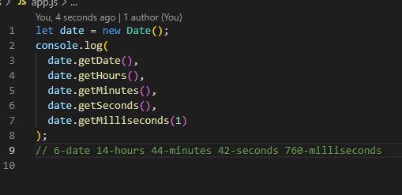

# OBJECTS-New

# Объекты

> Как мы знаем из главы Типы данных, в JavaScript существует 8 типов данных. Семь из них называются «примитивными», так как содержат только одно значение (будь то строка, число или что-то другое).

Объекты же используются для хранения коллекций различных значений и более сложных сущностей. В JavaScript объекты используются очень часто, это одна из основ языка. Поэтому мы должны понять их, прежде чем углубляться куда-либо ещё.

Объект может быть создан с помощью фигурных скобок {…} с необязательным списком свойств. Свойство – это пара «ключ: значение», где ключ – это строка (также называемая «именем свойства»), а значение может быть чем угодно.

Мы можем представить объект в виде ящика с подписанными папками. Каждый элемент данных хранится в своей папке, на которой написан ключ. По ключу папку легко найти, удалить или добавить в неё что-либо.

> let user = new Object(); // синтаксис "конструктор объекта"
> let user = {}; // синтаксис "литерал объекта"
> Объект, объявленный через const, может быть изменён.

Например:

const user = {
name: "John"
};

user.name = "Pete"; // (\*)

alert(user.name); // Pete
Может показаться, что строка (\*) должна вызвать ошибку, но нет, здесь всё в порядке. Дело в том, что объявление const защищает от изменений только саму переменную user, а не её содержимое.

Определение const выдаст ошибку только если мы присвоим переменной другое значение: user=....

Есть ещё один способ сделать константами свойства объекта, который мы рассмотрим в главе

> let user = {
> name: "John",
> age: 30
> };

let key = prompt("Что вы хотите узнать о пользователе?", "name");

// доступ к свойству через переменную
alert( user[key] ); // John (если ввели "name")

# Metodh object js

> keys для ключей показивает ключей
> values - для элемнтов показивает элементов
> entries - сделает из обекта массив каждое ключ и элемент один масив
> this у вай он
> Усулҳо ба монанди call(), application() ва bind() метавонанд инро ба ягон объект ишора кунанд
> Explicit Function Binding
> The call() and apply() methods are predefined JavaScript methods.
> They can both be used to call an object method with another object as argument.
> Ҳатмӣ будани функсияи ошкор
> Усулҳои call() ва application() усулҳои пешакӣ муайяншудаи JavaScript мебошанд.
> Ҳардуи онҳоро метавон истифода бурд, ки усули объектро бо объекти дигар ҳамчун далел даъват кунад.

# undefind

> Запись «через точку» такого не позволяет:

let user = {
name: "John",
age: 30
};

let key = "name";
alert( user.key ); // undefined

# Свойство из переменной

> В реальном коде часто нам необходимо использовать существующие переменные как значения для свойств с тем же именем.

Например:

function makeUser(name, age) {
return {
name: name,
age: age
// ...другие свойства
};
}

let user = makeUser("John", 30);
alert(user.name); // John

# Ограничения на имена свойств

> Как мы уже знаем, имя переменной не может совпадать с зарезервированными словами, такими как «for», «let», «return» и т.д.

Но для свойств объекта такого ограничения нет:

// эти имена свойств допустимы
let obj = {
for: 1,
let: 2,
return: 3
};

alert( obj.for + obj.let + obj.return ); // 6

# Проверка существования свойства, оператор «in»

> В отличие от многих других языков, особенность JavaScript-объектов в том, что можно получить доступ к любому свойству. Даже если свойства не существует – ошибки не будет!

При обращении к свойству, которого нет, возвращается undefined. Это позволяет просто проверить существование свойства:

let user = {};

alert( user.noSuchProperty === undefined ); // true означает "свойства нет"
Также существует специальный оператор "in" для проверки существования свойства в объекте.

Синтаксис оператора:

"key" in object
Пример:

let user = { name: "John", age: 30 };

alert( "age" in user ); // true, user.age существует
alert( "blabla" in user ); // false, user.blabla не существует
Обратите внимание, что слева от оператора in должно быть имя свойства. Обычно это строка в кавычках.

Если мы опускаем кавычки, это значит, что мы указываем переменную, в которой находится имя свойства. Например:

let user = { age: 30 };

let key = "age";
alert( key in user ); // true, имя свойства было взято из переменной key
Для чего вообще нужен оператор in? Разве недостаточно сравнения с undefined?

В большинстве случаев прекрасно сработает сравнение с undefined. Но есть особый случай, когда оно не подходит, и нужно использовать "in".

Это когда свойство существует, но содержит значение undefined:

let obj = {
test: undefined
};

alert( obj.test ); // выведет undefined, значит свойство не существует?
alert( "test" in obj ); // true, свойство существует!
В примере выше свойство obj.test технически существует в объекте. Оператор in сработал правильно.

Подобные ситуации случаются очень редко, так как undefined обычно явно не присваивается. Для «неизвестных» или «пустых» свойств мы используем значение null. Таким образом, оператор in является экзотическим гостем в коде.

# dataДата и Время

> Для работы с датой и временем в JavaScript используются объекты Date.

# Создание

> Для создания нового объекта типа Date используется один из синтаксисов:
> [

# Получение компонентов даты

> Для доступа к компонентам даты-времени объекта Date используются следующие методы:

getFullYear()
Получить год (из 4 цифр)
getMonth()
Получить месяц, от 0 до 11.
getDate()
Получить число месяца, от 1 до 31.
getHours(), getMinutes(), getSeconds(), getMilliseconds()

> [
> [
> [
> [
